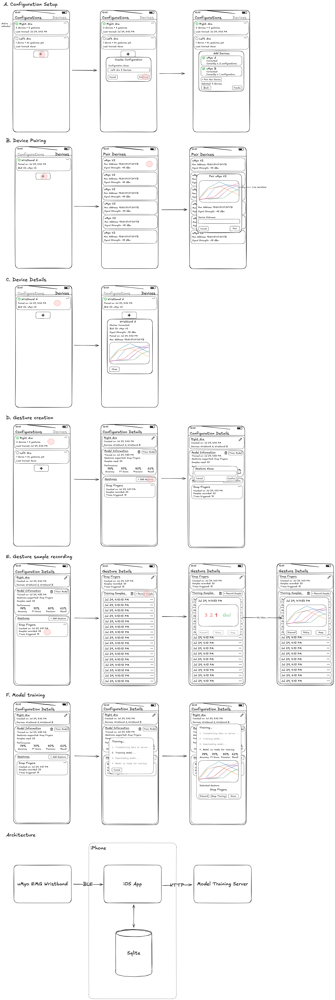

# Docs

## Description

This is a project using uMyo EMG sensors to make a wristband, which sends data to an iPhone via Bluetooth, which is then used to perform gesture classification.

Each gesture can then be paired with an action. An action can be any API call that can be performed by the phone, such as HomeKit and Shortcuts APIs.

## Milestones

V1: Limit to basic gesture recognition flow, no actions yet.

V2: Build out action assignment flow.

## V1 Core User Flows



## Technical Architecture


The architecture for this project is fairly simple. All of the functionalities except for model training runs on-device, so we just need a client and a server with a training endpoint.

### Endpoints

```
POST /train-model
- Body: training data
- Returns: CoreML model + metrics
  
GET /health
- Health check
```

## Discussions

- **On-device training?**: So Apple has two ML frameworks: CreateML and CoreML. 
CreateML is Apple's AutoML solution (automates things like feature engineering, algorithm selection, and hyperparameter tuning) to training models, 
while CoreML is the inference framework for running models on-device.
CreateML provides several model types out of the box, but not all of them can be trained on mobile devices (iOS, iPadOS, visionOS).
The model we would need for this type of application (time-series data) would be the MLActivityClassifier which can only be trained on macOS.
So, no on-device training is possible.

- **CreateML vs Sklearn**: At the end of the day, we need a CoreML model to run on-device. 
We can achieve this by creating the model using CreateML or convert an Sklearn model using Apple's library "coremltools".
Since we have to train this model off-device anyway, Sklearn would be more flexible since it can be trained on any device, not just Macs. 
It's probably also easier to achieve better performance since we have more control over the model (and I'm much more familiar with it).
Therefore, we'll be training models using Sklearn. 

## Data Model


```
Table Configuration {
  id integer [primary key, increment]
  name varchar [not null]
  created_at timestamp [not null, default: `now()`]
  is_active boolean [not null, default: false]

  Note: "Represents a logical grouping of one or more devices for gesture recognition. This is because when chaining multiple uMyo devices, each device still transmits data separately."
}

Table Device {
  id integer [primary key, increment]
  name varchar [not null]
  bluetooth_id varchar [not null, unique]
  mac_address varchar(17) [not null, unique]
  paired_at timestamp [not null, default: `now()`]

  Note: "Represents a paired uMyo device"
}

Table ConfigurationDevice {
  id integer [primary key, increment]
  configuration_id integer [not null, ref: > Configuration.id]
  device_id integer [not null, ref: > Device.id]

  indexes {
    (configuration_id, device_id) [unique, note: "Prevent duplicate device assignments"]
  }

  Note: "Junction table to track which devices belong to what configurations"
}

Table Gesture {
  id integer [primary key, increment]
  configuration_id integer [not null, ref: > Configuration.id]
  name varchar [not null]
  created_at timestamp [not null, default: `now()`]
  times_triggered integer [not null, default: 0]

  Note: "Represents a user-defined gesture, specific to a device configuration"
}

Table Sample {
  id integer [primary key, increment]
  gesture_id integer [not null, ref: > Gesture.id]
  recorded_at timestamp [not null, default: `now()`]
  duration double [not null, note: "Duration in seconds"]

  Note: "Represents a single training sample for a gesture. Contains measurements from all devices in the configuration"
}

Table Measurement {
  id integer [primary key, increment]
  sample_id integer [not null, ref: > Sample.id]
  device_id integer [not null, ref: > Device.id]
  
  // raw sensor data
  packet_id integer [not null]
  battery_level integer [not null]
  spectrum_0 integer [not null]
  muscle_avg integer [not null]
  spectrum_1 integer [not null]
  spectrum_2 integer [not null]
  spectrum_3 integer [not null]
  quaternion_w integer [not null]
  quaternion_x integer [not null]
  quaternion_y integer [not null]
  quaternion_z integer [not null]

  // computed attributes
  roll double [not null]
  pitch double [not null]
  yaw double [not null]
  muscle_level double [not null]

  Note: "Represents a single measurement from a specific device during sample recording. Includes both raw and computed attributes."
}

Table Model {
  id integer [primary key, increment]
  configuration_id integer [not null, ref: > Configuration.id]
  trained_at timestamp [not null, default: `now()`]
  samples_used integer [not null]
  supported_gesture_ids text [not null, note: "Array of gesture IDs"]
  is_active boolean [not null, default: false]
  model blob [not null, note: "CoreML binary"]
  accuracy double [not null, note: "0.0 to 1.0"]
  f1_score double [not null, note: "0.0 to 1.0"]
  precision double [not null, note: "0.0 to 1.0"]
  recall double [not null, note: "0.0 to 1.0"]

  Note: "Represents a trained multi-class classification model for a device configuration"
}
```

## uMyo Advertisement Data Packet Layout

Notes: 
- The first x bytes are skipped until we find the first 0x08 (byte value of 8). Byte 0 below is byte x + 1. 
- Comments that indicate how something is used is based on [uMyo’s Arduino Library](https://github.com/ultimaterobotics/uMyo_BLE/tree/master) for parsing uMyo’s BLE data on nRF52x and ESP32-based Arduinos. 
- Discussion around spectrum calculation is based on [uMyo’s firmware](https://github.com/ultimaterobotics/uMyo/blob/main/uMyo_fw_v3_1/main.c).
- Somehow in Swift we can just use manufacturer data with `advertisementData[CBAdvertisementDataLocalNameKey]` to grab the 15 bytes beginning with adc_id so we don’t need to skip the headers ourselves.


| Byte | Content | Comment | Parsing Notes |
|------|---------|---------|---------------|
| 0 | 8 (0x08) | Start of header/useful data. Not meant to be used as the ASCII character ‘8’, this is the decimal 8. |   |
| 1 | ‘u’ (0x75) | These next ones are ASCII characters. Perhaps useful to filter out useless packets? |   |
| 2 | ‘M’ (0x4D) |   |   |
| 3 | ‘y’ (0x79) |   |   |
| 4 | ‘o’ (0x6F) |   |   |
| 5+ | 255 (0xFF) | Location seems to vary — there maybe a gap between ‘o’ and 0xFF. <br>while(pack[pp] != 255 && pp < len) pp++; |   |
| Next | adc_id | This is the packet sequence id — telling us the correct order of packets. |   |
| Next+1 | batt_level | Battery level. To get the battery mv do: <br>2000 + batt_level*10 |   |
| Next+2 | sp0 | Spectrum[0]. This is sent as 8-bits but it’s actually sent at reduced precision and must be left shifted to 16-bits. <br>Along with sp1, not really used to calculate anything.<br>The uMyo device performs FFT that takes in 8 input samples and produces 4 frequency bins (spectrum).<br>It seems that the later bins (2 and 3) represent higher frequencies than the earlier bins (0 and 1) — search for high_sp in main.c. | Left-shift 8 bits.<br>int16_t sp0 = pack[pp++]<<8; |
| Next+3 | muscle_avg | Device-calculated average of muscle activity level. Shouldn’t be used directly; these are used to calculate device_avg_muscle_level. <br>Not the same as the user-calculated getMuscleLevel using spectrums. |   |
| Next+4-5 | sp1 | Spectrum[1]. Along with sp0, not used to calculate anything. | 2 bytes in big-endian format. Left-shift 8 bits.<br>int16_t sp1 = (pack[pp]<<8) \| pack[pp+1]; pp += 2; |
| Next+6-7 | sp2 | Spectrum[2]. Used with sp3 to calculate muscleLevel. | 2 bytes in big-endian format. Left-shift 8 bits. |
| Next+8-9 | sp3 | Spectrum[3]. Used with sp2 to calculate muscleLevel. Valued twice as much as sp2. <br>float lvl = devices[devidx].cur_spectrum[2] + 2*devices[devidx].cur_spectrum[3]; | 2 bytes in big-endian format. Left-shift 8 bits. |
| Next+10-11 | qw | W component of the quaternion. <br>A quaternion is a mathematically convenient alternative to euler angle representation for 3D rotations and is made up of four parts {x, y, z, w}.<br>We can use these directly in our models or to compute roll, yaw, and pitch first. | 2 bytes in big-endian format. Left-shift 8 bits. |
| Next+12 | qx | X component of the quaternion. | Left-shift 8 bits. |
| Next+13 | qy | Y component of the quaternion. | Left-shift 8 bits. |
| Next+14 | qz | Z component of the quaternion. | Left-shift 8 bits. |
