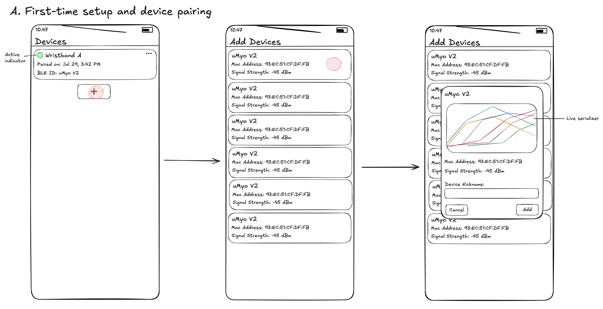
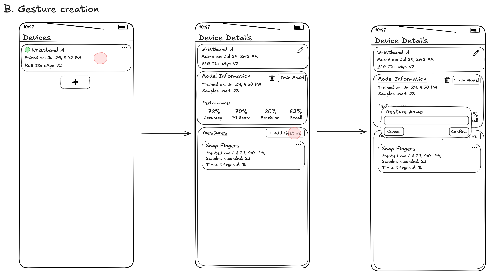
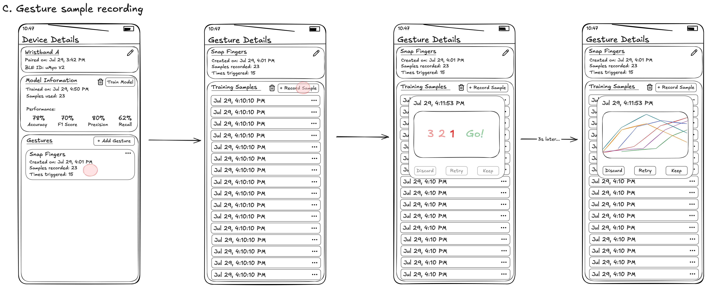
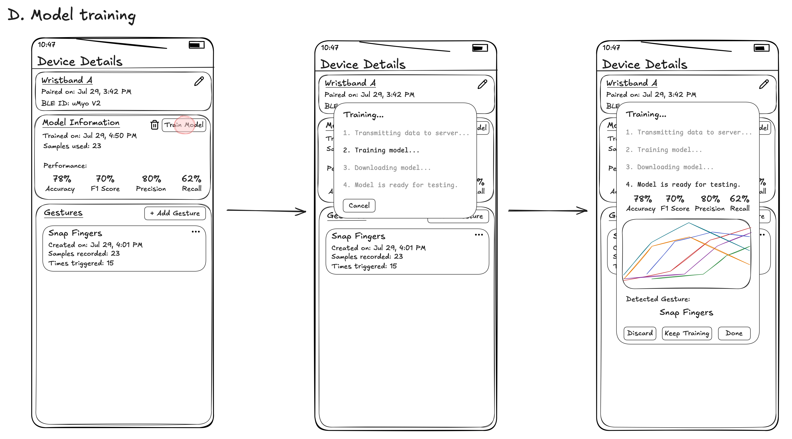
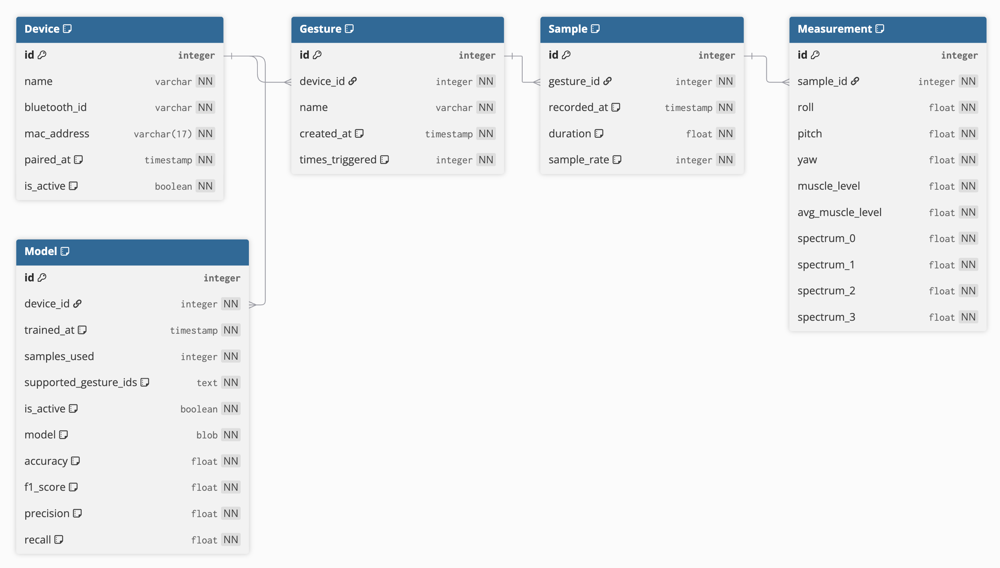
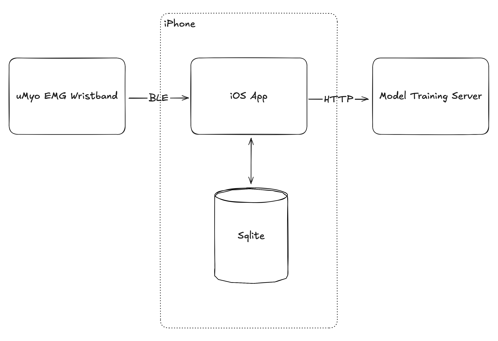

# Docs

## Description

This is a project using uMyo EMG sensors to make a wristband, which sends data to an iPhone via Bluetooth, which is then used to perform gesture classification.

Each gesture can then be paired with an action. An action can be any API call that can be performed by the phone, such as HomeKit and Shortcuts APIs.

## Milestones 

V1: Limit to basic gesture recognition flow, no API calls yet. Only allow one model at a time -- new model rewrites old model.

V2: Build out action assignment flow.

## V1 Core User Flows:

A. **First-time setup and device pairing**:
  1. Home page shows a list of paired devices with a button to add a device.
     - Maybe show which device is active too right now, limit to one active device at a time.
  2. Clicking on the button navigates to "Add Devices" page for BLE device discovery.
     - Maybe good to limit results to uMyo devices only.
  3. Clicking on a discovered device opens a pop-up with buttons to cancel or add the device along with a field to input a device name.
     - Optional: provide a serializer in the same pop-up to show that the device is transmitting data.



B. **Gesture creation**:
  1. Gestures are specific to a device. After a device is paired, user can click on the device to show details and create a gesture.
  2. Clicking on "Create Gesture" opens a pop-up requesting a name (e.g., "snap fingers") and a button to confirm. 



C. **Gesture sample recording**:  
  1. Once gesture is created, we navigate to the gesture details page which includes a section to show training samples along with a button to start recording samples.
  2. Clicking "Record Sample" shows a pop-up with a 3 seconds countdown before it begins recording. Once it begins, it will show a live serializer and record for 3 seconds.
  3. Once a sample is recorded, the live visualizer is replaced with a static waveform of the recording and three buttons: "Discard", "Retry", or "Keep".
  4. If user selects "Keep", the sample is saved and the pop-up is closed.
     - If a user wants to record multiple samples in a row, they can just click Record Sample again. This might be jarring, but we can revisit later.



D. **Model training**:  
  1. Once there is at least 10 training samples, user can go back to the device details page and click on "Train Model".
     - We are training a single multi-class model so it can distinguish between all gestures + a "none".
  2. The app will call an external endpoint and export the training data to train the model.
  3. For simplicity, our first version will just make the user wait until training is done.
  4. Once training is complete, user will be shown model performance metrics and three buttons: "Discard", "Keep Training", or "Done" along with a live serializer and a "Detected Gesture" for live testing.
  5. Clicking on "Done" will save the model on-device and allow the user to activate a device for real-time gesture recognition.



## Discussions:

- **On-device training?**: So Apple has two ML frameworks: CreateML and CoreML. 
CreateML is Apple's AutoML solution (automates things like feature engineering, algorithm selection, and hyperparameter tuning) to training models, 
while CoreML is the inference framework for running models on-device.
CreateML provides several model types out of the box, but not all of them can be trained on mobile devices (iOS, iPadOS, visionOS).
The model we would need for this type of application (time-series data) would be the MLActivityClassifier which can only be trained on macOS.
So, no on-device training is possible.

- **CreateML vs Sklearn**: At the end of the day, we need a CoreML model to run on-device. 
We can achieve this by creating the model using CreateML or convert an Sklearn model using Apple's library "coremltools".
Since we have to train this model off-device anyway, Sklearn would be more flexible since it can be trained on any device, not just Macs. 
It's probably also easier to achieve better performance since we have more control over the model (and I'm much more familiar with it).
Therefore, we'll be training models using Sklearn. 

## Data Model



### Device

Represents a paired uMyo device. 

**Relationships**:
- Has many gestures 
- Has one model

**Properties**:
- id | pk
- name 
- bluetooth_id
- mac_address
- paired_at
- is_active 

### Gesture

Represents a user-defined gesture, specific to a device.

**Relationships**:
- Belongs to one device 
- Has many training samples

**Properties**:
- id | pk
- device_id | fk
- name
- created_at
- times_triggered

### Sample

Represents a single training sample for a gesture. One training sample contains many measurements (depending on sample rate).

**Relationships**:
- Belongs to one gesture 
- Has many data points

**Properties**: 
- id | pk 
- gesture_id | fk 
- recorded_at 
- duration
- sample_rate

### Measurement

Represents a single raw measurement (data point) for a training sample.

**Relationships**:
- Belongs to one training sample

**Properties**:
- id | pk 
- sample_id | fk 
- roll
- pitch 
- yaw 
- muscle_level
- avg_muscle_level
- spectrum_0
- spectrum_1
- spectrum_2
- spectrum_3

### Model 

Represents a trained multi-class classification model using samples from all gestures for a specific device.
In v1, we won't be able to view/switch to old models, but eventually one device can have multiple models with one active at a time.

**Relationships**: 
- Belongs to one device 

**Properties**:
- id | pk 
- device_id | fk 
- trained_at
- samples_used
- supported_gesture_ids // not a fk or junction table because we just need to know which gestures this model supports
- is_active
- model
- accuracy 
- f1_score 
- precision 
- recall

## Technical Architecture



The architecture for this project is fairly simple. All of the functionalities except for model training runs on-device, so we just need a client and a server with a training endpoint.

### Endpoints

```
POST /train-model
- Body: training data
- Returns: CoreML model + metrics
  
GET /health
- Health check
```