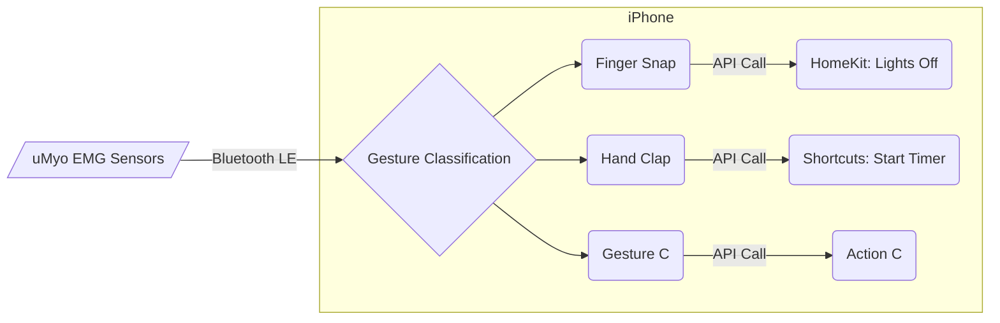

# Home

## Description

This is a project using uMyo EMG sensors to make a wristband, which sends data to an iPhone via Bluetooth, which is then used to perform gesture classification. 

Each gesture can then be paired with an action. An action can be any API call that can be performed by the phone, such as HomeKit and Shortcuts APIs.



## Motivation

- uMyo right now provides 3 connection modes:
    - skip the middleman
    - phones are powerful
- The decoupling of Gestures and Actions provides lots of possibilities
- Learning experience, as I'm looking to break into this field of HCI/BCI/AR 
- Meta Orion, JRE
- Problems with current AR control methods: hand has to be in front of camera -> tiring, awkward

## Project Structure 

```
da-band/
├── band/    # PlatformIO-managed arduino project for wristband firmware
├── ios/     # Tuist-managed Xcode project for iOS app
└── docs/    # Mkdocs-material docs for this project
```

## Milestones

| Milestone | Status | Description |
|-----------|---------|-------------|
| **M1** | :construction:{title="In Progress"} | A binary classification model for 1 gesture is ready to be used. Manually tap a button in the iOS app to start listening for 3 seconds and perform exactly 1 instance of the trained gesture. |
| **M2** | :white_large_square:{title="Planned"} | A multi-class classification model for 2 or more gestures are ready to be used. iOS app continuously receives data and calculates probabilities of gesture activation using a rolling window of past 3 seconds of data, every second. If the highest probability exceeds some threshold, trigger that gesture. |
| **M3** | :white_large_square:{title="Planned"} | Whenever a gesture triggers, send notification to user asking whether it was an accurate detection. If yes, store as a new sample for future fine-tuning. |
| **M4** | :white_large_square:{title="Planned"} | Band only sends data after some trigger and is inactive otherwise. Trigger can be some threshold for a feature(s), or perhaps fit the band with a gyroscope so that it needs to be raised before it turns on (ala an Apple Watch.) |

